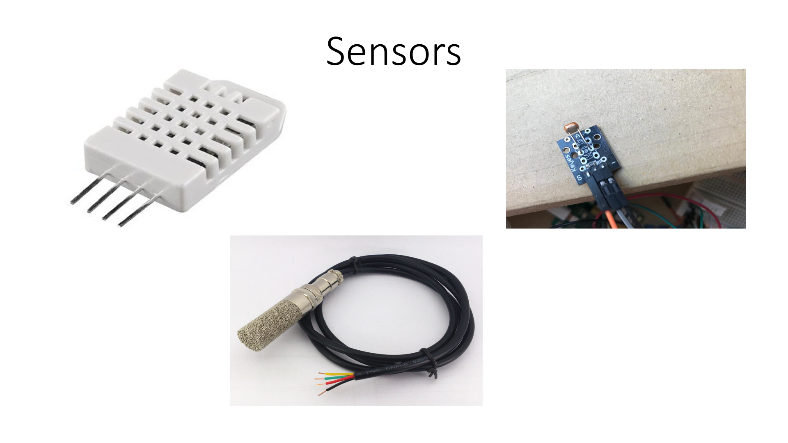
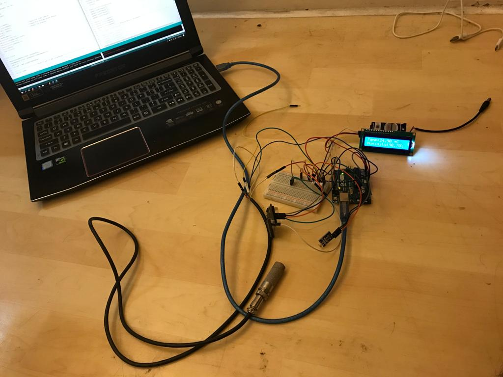
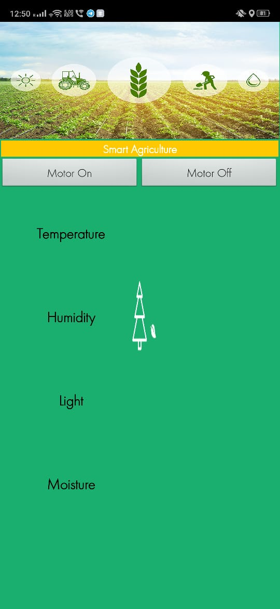

# Smart-Agriculture
The project aims to help Farmers by providing information about their agriculture fields. Monitoring environmental factors is the major factor to improve the yield of the crops. The feature of this project includes monitoring temperature, humidity and moisture in agricultural field through sensors DHT11, YL69. We are providing farmers with app to turn ON/OFF the motor. The App also shows the farmer about Fields current moisture , humidity,Temperature and Light Intensity.

# Hardware 

# Mobile App

